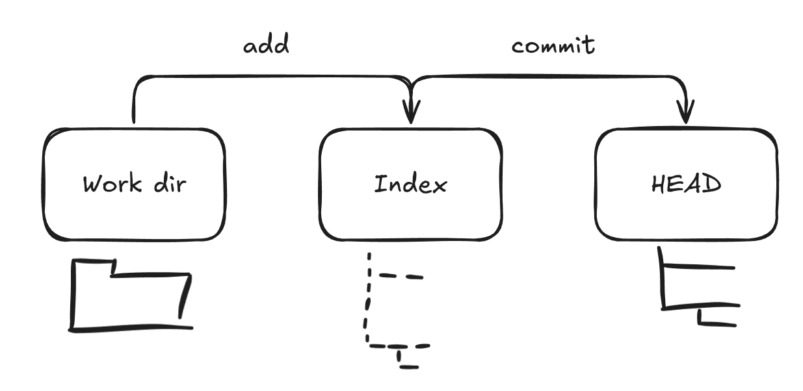
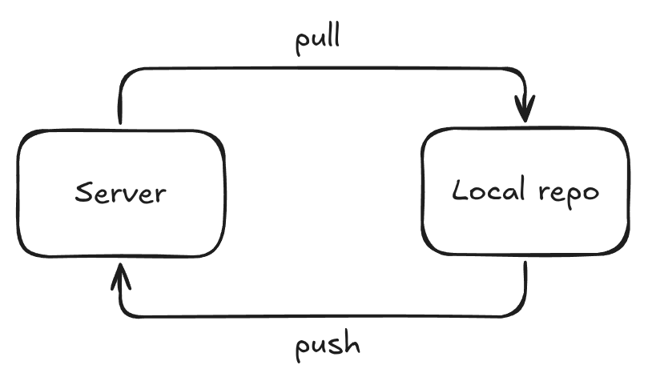

# 💡 02. GIT: Базовые комманды

* **Инструмент:** [GIT](README.md)
* **Сложность:** 🟢 Новичок
* **Дата последнего обновления:** 2025-11-26

---

## 🎯 Проблема / Цель

Как работать с git на базовом уровне?

---

## 2️⃣ 1. Инициализация и работа с репозиторием

### Создать новый репозиторий

Для создания нового репозитория вам необходимо:

* Создать новый каталог
* Перейти в него
* Выполнить:

```bash
git init
```

### Клонировать репозиторий

Создайте рабочую копию локального репозитория, выполнив команду

```bash
git clone /path/to/repository
```

При использовании удаленного сервера ваша команда будет использовать:

```bash
git clone username@host:/path/to/repository
```

### Workflow

Ваш локальный репозиторий состоит из трех «деревьев», поддерживаемых git. первый - ваша **рабочая директория** в котором хранятся сами файлы. Второй - это **Index** который действует как плацдарм и наконец-то **HEAD** который указывает на последний сделанный вами коммит.


#### add & commit

Вы можете добавить изменения в Index с помощью:

```bash
git add <путь к файлу>
git add .
```

Чтобы зафиксировать эти изменения вы можете использовать:

```bash
git commit -m "Сообщение commit-а"
```

#### Отправить изменения на сервер

Ваши изменения теперь находятся в HEAD разделе. Чтобы отправить эти изменения на сервер, используйте:

```bash
git push origin <ветка>
```

Если же вы не клонировали существующий репозиторий и хотите подключить свой репозиторий к удаленному серверу, вам необходимо добавить его с помощью:

```bash
git remote add origin <server>
```

После этого вы можете выполнить `git push`.

#### Загрузить последние изменения с сервера

В ветке которой вы работаете во время внесения вами изменений, другие разработчики могли внести свои изменения. Чтобы не создавать расхождений между удаленной и локальной веткой, перед `git push` или `git commit`, выполните следующую команду:

```bash
git pull origin <ветка>
```



### Ветвление

**Ветки используются для:**

1. **Разработки изолированных изменений:** Ветки позволяют работать над новой функцией, исправлением ошибки или экспериментом, не затрагивая стабильную основную версию.
2. **Разделения версий проекта:** Ветки могут использоваться для маркировки и поддержки различных выпусков или версий (например, v1.0.x, v2.0.x)
3. **Введения контролируемого рабочего процесса:** Ветки необходимы для таких моделей разработки, как Git Flow или GitHub Flow.
4. **Подготовки к код-ревью:** Ветки являются основой для PR (Pull Request)


Работа с ветвями будет продемонстрированна для _разработки изолированных изменений_.
Создадим новую ветку с именем "feature/001_XXX", переключимся на ветку "master" и удалим только что созданную ветку:

```bash
git checkout -b feature/001_XXX
git checkout master
git branch -D feature/001_XXX
```

Пока вы не отправите новую ветку в удаленный репозиторий, у других нет к ней доступа.

```bash
git push origin <ветка>
```

Для практики вы можете использовать [данный тренажёр](https://learngitbranching.js.org/).

---

## Что дальше?

В написании.

---

## ↩️ Назад

* [⬅️ Назад к Содержанию GIT](README.md)
