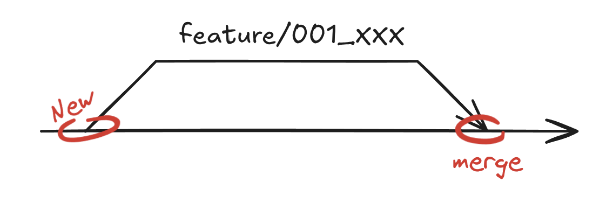

# 💡 03. GIT: Ветви

* **Инструмент:** [GIT](README.md)
* **Сложность:** 🟢 Новичок
* **Дата последнего обновления:** 2025-11-28

---

## 🎯 Цель

Вы научитесь работать с ветками в Git.

---

## 🪾 Ветвление

**Ветки используются для:**

1. **Разработки изолированных изменений:** Ветки позволяют работать над новой функцией, исправлением ошибки или экспериментом, не затрагивая стабильную основную версию.
2. **Разделения версий проекта:** Ветки могут использоваться для маркировки и поддержки различных выпусков или версий (например, v1.0.x, v2.0.x)
3. **Введения контролируемого рабочего процесса:** Ветки необходимы для таких моделей разработки, как Git Flow или GitHub Flow.
4. **Подготовки к код-ревью:** Ветки являются основой для PR (Pull Request)



Работа с ветвями будет продемонстрированна для _разработки изолированных изменений_.
Создадим новую ветку с именем "feature/001_XXX", переключимся на ветку "main" и удалим только что созданную ветку:

```bash
# Посмотреть список всех локальных веток
git branch

# Создание и немедленный переход на новую ветку "feature/001_XXX"
git checkout -b feature/001_XXX

# Переключение на главную ветку (main)
git checkout main

# Слияние изменений из ветки feature/001_XXX в текущую ветку (main)
git merge feature/001_XXX

# Удаление локальной ветки (если она больше не нужна и слита)
git branch -d feature/001_XXX

# Принудительное удаление локальной ветки (даже если не слита)
git branch -D feature/001_XXX
```

Пока вы не отправите новую ветку в удаленный репозиторий, у других нет к ней доступа.

```bash
git push origin <ветка>
```

Для практики вы можете использовать [данный тренажёр](https://learngitbranching.js.org/).

### 🪟 Просмотр существующих ветвей (`git branch`)

Для просмотра существующих ветвей вы можете использовать:

```bash
git branch
```

### 🛻 Переход между ветвями (`git checkout`)

Чтобы перейти на существующую ветку:

```bash
git checkout <ветка>
```

Чтобы создать и перейти в только что созданную ветвь:

```bash
git checkout -b <имя новой ветви>
```

### 🌊 Слияни ветвей (`git merge`)

Чтобы слить изменения из feature ветви в main ветвь, необходимо выполнить:

```bash
# переход в main ветку
git checkout main

# сливание изменений из feature_XXX ветки, в main ветвь
git merge feature_XXX
```

В процессе слияния могут возникнуть конфликты которые необходимо будет исправить вручную.

### 🚫 Удаление ветвей

Для того чтобы удалить ветвь локально используйте:

```bash
# если она больше не нужна и слита
git branch -d <ветвь>

# или, даже если не слита
git branch -D <ветвь>
```

---

## ❓ Что дальше?

* [51. Ветви - Продвинутые](51_branches_advanced.md)

---

## ↩️ Назад

* [⬅️ Назад к Содержанию GIT](README.md)
